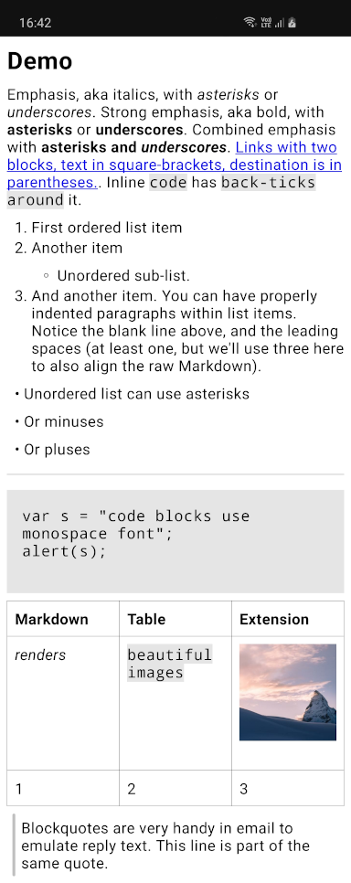

# Markdown

Library for rendering Markdown in Compose using Atlassian's [CommonMark](https://github.com/atlassian/commonmark-java)
library to parse, and `richtext-ui` to render.

## Gradle

```groovy
dependencies {
  implementation "com.halilibo.compose-richtext:richtext-commonmark:${richtext_version}"
}
```

## Usage

The simplest way to render markdown is just pass a string to the [`Markdown`](/api/com.zachklipp.richtext.markdown/-markdown/)
composable:

~~~kotlin
Markdown(
  """
  # Demo
  
  Emphasis, aka italics, with *asterisks* or _underscores_. Strong emphasis, aka bold, with **asterisks** or __underscores__. Combined emphasis with **asterisks and _underscores_**. [Links with two blocks, text in square-brackets, destination is in parentheses.](https://www.example.com). Inline `code` has `back-ticks around` it.
  
  1. First ordered list item
  2. Another item
      * Unordered sub-list.
  3. And another item.
      You can have properly indented paragraphs within list items. Notice the blank line above, and the leading spaces (at least one, but we'll use three here to also align the raw Markdown).

  * Unordered list can use asterisks
  - Or minuses
  + Or pluses
  ---

  ```javascript
  var s = "code blocks use monospace font";
  alert(s);
  ```

  Markdown | Table | Extension
  --- | --- | ---
  *renders* | `beautiful images` | 
  1 | 2 | 3

  > Blockquotes are very handy in email to emulate reply text.
  > This line is part of the same quote.
  """.trimIndent(),
  Modifier.padding(16.dp)
)
~~~

Which produces something like this:



The `Markdown` composable also takes an optional `RichTextStyle` which can be used to customize how
it's rendered.
